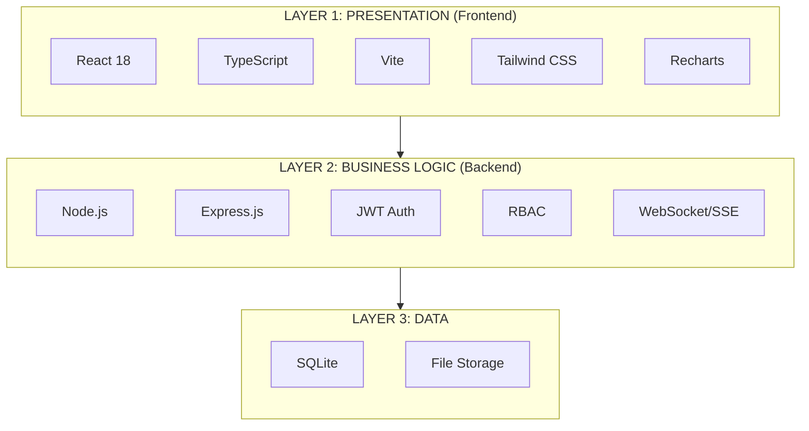

# Gyandeep Architecture Design

## Three-Tier Architecture



---

## Layer 1: Presentation Layer (Frontend)

### Technology Stack
- **React 18** - UI library
- **TypeScript** - Type-safe JavaScript
- **Vite** - Build tool
- **Tailwind CSS** - Styling
- **Recharts** - Charts
- **face-api.js** - Face recognition

### Key Components
1. **Dashboards**: Student, Teacher, Admin
2. **Features**: Quiz, Timetable, Grade Book, Notes, Attendance
3. **AI**: Chatbot (Gemini AI), Voice Service

---

## Layer 2: Business Logic Layer (Backend)

### Technology Stack
- **Node.js** - JavaScript runtime
- **Express.js** - Web framework
- **SQLite3** - Database
- **JWT** - Authentication
- **Socket.io** - Real-time updates

### API Endpoints
| Category | Endpoints |
|----------|-----------|
| Auth | `/api/auth/*` - Login, register, password reset, OAuth |
| Users | `/api/users` - User CRUD |
| Classes | `/api/classes` - Class management |
| Grades | `/api/grades` - Grade operations |
| Timetable | `/api/timetable` - Schedule |
| Notes | `/api/notes` - Notes upload/retrieval |
| Quiz | `/api/quiz` - AI quiz generation |
| Chat | `/api/chat` - AI chatbot |
| Attendance | `/api/attendance` - Attendance tracking |
| Analytics | `/api/analytics/*` - AI insights |
| Tickets | `/api/tickets` - Support tickets |
| Notifications | `/api/notifications` - Push notifications |

### Real-Time
- **Server-Sent Events (SSE)** - Live updates for grades, timetable, tickets
- **WebSocket** - Optional real-time features

---

## Layer 3: Data Layer (Storage)

### SQLite Database Tables
- `users` - Students, teachers, admins
- `classes` - Class configurations
- `grades` - Student grades
- `attendance` - Attendance records
- `timetable_entries` - Schedule
- `question_bank` - Quiz questions
- `tickets` - Support tickets
- `centralized_notes` - Study notes
- `audit_logs` - System audit trail

### File Storage
- User profile images
- Face recognition data
- Uploaded notes/documents

---

## Deployment

### Docker Compose
```yaml
services:
  api:
    build: ./server
    ports:
      - "3001:3001"
    volumes:
      - gyandeep-data:/app/server/data
  
  frontend:
    build: .
    ports:
      - "5173:5173"
    depends_on:
      - api
```

### Environment Variables
```
VITE_API_URL=http://localhost:3001
JWT_SECRET=<strong-secret>
SESSION_SECRET=<strong-secret>
GEMINI_API_KEY=<gemini-key>
```

---

## Data Flow

```
User Action → React UI → Express API → JWT Auth → RBAC → SQLite → Response
                                        ↓
                              SSE/WebSocket → Real-time Updates
```

---

## User Roles

| Role | Permissions |
|------|-------------|
| **Student** | View dashboard, take quizzes, view grades, mark attendance |
| **Teacher** | Generate quizzes, upload notes, mark attendance, manage grades |
| **Admin** | Manage users, system config, view analytics, face recognition |
