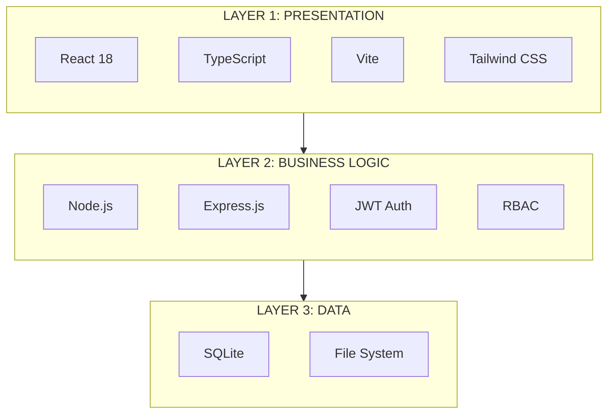

# Gyandeep Architecture Design

## Three-Layer Architecture

---

## Layer 1: Presentation Layer (Frontend)

### Technology Stack
- **React 18** - UI library for building user interfaces
- **TypeScript** - Type-safe JavaScript
- **Vite** - Build tool for fast development
- **Tailwind CSS** - Utility-first CSS framework

### Key Components
1. **User Interfaces**
   - Login/Authentication screens
   - Student Dashboard
   - Teacher Dashboard
   - Admin Dashboard

2. **Learning Features**
   - Quiz View
   - Digital Classroom
   - Timetable
   - Grade Book

3. **Analytics & Monitoring**
   - Realtime Analytics
   - Performance Charts
   - Attendance Charts
   - Engagement Metrics

4. **Blockchain Integration**
   - Blockchain Wallet
   - NFT Certificates
   - Immutable Records

5. **Advanced Features**
   - 3D Dashboard (React Three Fiber)
   - Face Recognition (face-api.js)
   - Voice Service
   - Chatbot (AI)

---

## Layer 2: Business Logic Layer (Backend)

### Technology Stack
- **Node.js** - JavaScript runtime
- **Express.js** - Web application framework
- **JWT** - JSON Web Token for authentication
- **RBAC** - Role-Based Access Control

### Key Services
1. **Authentication Service**
   - User registration and login
   - JWT token management
   - Session handling
   - Role-based permissions (Student, Teacher, Admin)

2. **Quiz Service**
   - Quiz generation
   - Quiz submission and scoring
   - Quiz history tracking

3. **Attendance Service**
   - Location-based attendance marking
   - Real-time attendance tracking
   - Attendance reports

4. **Grade Service**
   - Grade management
   - Performance tracking
   - Grade analytics

5. **Notes Service**
   - Notes upload and storage
   - File management
   - Notes sharing

6. **Analytics Service**
   - Performance analytics
   - Engagement metrics
   - Learning insights

7. **Blockchain Service**
   - Smart contract interaction
   - Attendance recording on blockchain
   - Grade verification
   - NFT certificate minting

8. **AI/ML Services**
   - Google Gemini AI integration
   - Learning twin predictions
   - Chatbot intelligence

---

## Layer 3: Data Layer (Storage)

### Technology Stack
- **SQLite** - Lightweight relational database
- **File System** - Local storage for files

### Data Storage
1. **Database Tables**
   - Users (students, teachers, admins)
   - Classes
   - Attendance records
   - Grades
   - Quiz questions
   - Performance data

2. **File Storage**
   - Notes and documents
   - User profile images
   - Face recognition data
   - Media files

3. **Blockchain Storage**
   - Immutable attendance records
   - Grade verifications
   - NFT certificates

---

## User Roles & Permissions

| Role | Permissions |
|------|-------------|
| **Student** | View dashboard, take quizzes, view grades, mark attendance |
| **Teacher** | Generate quizzes, upload notes, mark attendance, manage grades |
| **Admin** | Manage users, system configuration, view analytics |

---

## Data Flow

1. **User Request** → React Frontend
2. **API Call** → Express.js Backend
3. **Authentication** → JWT Verification
4. **Authorization** → RBAC Check
5. **Business Logic** → Process Request
6. **Data Operation** → SQLite / File System
7. **Response** → Return to Frontend

---

## Security Features

1. **Authentication** - JWT-based secure login
2. **Authorization** - Role-based access control
3. **Input Validation** - Sanitized user inputs
4. **Rate Limiting** - Prevent abuse
5. **Data Encryption** - Secure data storage

---

## External Integrations

1. **Google Gemini AI** - AI-powered features
2. **Blockchain (Ethereum)** - Immutable records
3. **Server-Sent Events** - Real-time updates

---

## Technology Summary

| Category | Technologies |
|----------|--------------|
| Frontend | React 18, TypeScript, Vite, Tailwind CSS, React Three Fiber |
| Backend | Node.js, Express.js |
| Database | SQLite |
| Authentication | JWT |
| AI/ML | Google Gemini AI |
| Blockchain | Ethereum, Ethers.js |
| Face Recognition | face-api.js |
| Charts | Recharts, Chart.js |
| Real-time | WebSocket, SSE |
