# Level 1 Data Flow Diagram - Gyandeep 🕯️

## 📊 Colorful Level 1 DFD

```mermaid
flowchart TB
    %% External Entities - Different Colors
    subgraph EXTERNAL["📱 External Entities"]
        direction TB
        STUDENT["👨‍🎓 Student"]
        TEACHER["👩‍🏫 Teacher"]
        ADMIN["👨‍💼 Administrator"]
    end
    
    %% Style for External Entities
    style EXTERNAL fill:#e3f2fd,stroke:#1976d2,stroke-width:3px,color:#0d47a1
    style STUDENT fill:#bbdefb,stroke:#1565c0,stroke-width:2px
    style TEACHER fill:#bbdefb,stroke:#1565c0,stroke-width:2px
    style ADMIN fill:#bbdefb,stroke:#1565c0,stroke-width:2px

    %% Main Processes - Colorful Boxes
    subgraph PROCESSES["⚙️ Core Processes"]
        direction TB
        AUTH["🔐 Authentication\nSystem"]
        AI["🤖 AI Learning\nEngine"]
        CHAT["💬 Smart\nChatbot"]
        QUIZ["📝 Quiz\nGenerator"]
        BLOCKCHAIN["⛓️ Blockchain\nLedger"]
        EMAIL["📧 Email\nNotification"]
        NOTIFY["🔔 Real-time\nNotifications"]
    end
    
    %% Style for Processes
    style AUTH fill:#fff3e0,stroke:#e65100,stroke-width:3px,color:#bf360c
    style AI fill:#f3e5f5,stroke:#7b1fa2,stroke-width:3px,color:#4a148c
    style CHAT fill:#e8f5e9,stroke:#2e7d32,stroke-width:3px,color:#1b5e20
    style QUIZ fill:#fff8e1,stroke:#f9a825,stroke-width:3px,color:#f57f17
    style BLOCKCHAIN fill:#eceff1,stroke:#37474f,stroke-width:3px,color:#263238
    style EMAIL fill:#fce4ec,stroke:#c2185b,stroke-width:3px,color:#880e4f
    style NOTIFY fill:#e0f7fa,stroke:#00838f,stroke-width:3px,color:#006064

    %% Data Stores
    subgraph DATABASES["💾 Data Stores"]
        direction TB
        USER_DB["👥 User Database\n(Supabase)"]
        LOCAL_STORAGE["💿 Local Storage\n(Offline)"]
        BLOCKCHAIN_DB["⛓️ Blockchain\n(Immutable Records)"]
    end
    
    %% Style for Data Stores
    style USER_DB fill:#e8eaf6,stroke:#283593,stroke-width:3px,color:#1a237e
    style LOCAL_STORAGE fill:#fffde7,stroke:#fbc02d,stroke-width:3px,color:#f57f17
    style BLOCKCHAIN_DB fill:#cfd8dc,stroke:#455a64,stroke-width:3px,color:#263238

    %% External Services
    subgraph EXTERNAL_SERVICES["☁️ External Services"]
        direction TB
        GEMINI["🧠 Gemini AI\n(Google)"]
        FACE_AUTH["📸 Face ID\n(OpenCV/Web)"]
        EMAIL_SERVICE["📨 Email Service\n(SMTP)"]
    end
    
    %% Style for External Services
    style GEMINI fill:#e1f5fe,stroke:#0277bd,stroke-width:3px,color:#01579b
    style FACE_AUTH fill:#efebe9,stroke:#4e342e,stroke-width:3px,color:#3e2723
    style EMAIL_SERVICE fill:#fbe9e7,stroke:#d84315,stroke-width:3px,color:#bf360c

    %% Data Flows - Arrows with Labels
    %% Student Flows
    STUDENT -->|Login Request| AUTH
    STUDENT -->|Quiz Questions| AI
    STUDENT -->|Chat Messages| CHAT
    STUDENT -->|Take Quiz| QUIZ
    STUDENT -->|View Grades| BLOCKCHAIN
    
    %% Teacher Flows
    TEACHER -->|Manage Students| AUTH
    TEACHER -->|Create Quiz| QUIZ
    TEACHER -->|View Analytics| AI
    TEACHER -->|Send Announcements| NOTIFY
    
    %% Admin Flows
    ADMIN -->|System Config| AUTH
    ADMIN -->|Manage Users| USER_DB
    ADMIN -->|View Reports| BLOCKCHAIN
    
    %% Process to Data Store Flows
    AUTH -->|Verify User| USER_DB
    AUTH -->|Cache Data| LOCAL_STORAGE
    AI -->|Store Results| USER_DB
    CHAT -->|Save History| USER_DB
    QUIZ -->|Save Quiz| USER_DB
    BLOCKCHAIN -->|Record Transaction| BLOCKCHAIN_DB
    
    %% Process to External Service Flows
    AUTH -->|Face Verification| FACE_AUTH
    AI -->|Generate Content| GEMINI
    CHAT -->|AI Response| GEMINI
    QUIZ -->|Generate Quiz| GEMINI
    EMAIL -->|Send Email| EMAIL_SERVICE
    
    %% Real-time Flows
    NOTIFY -->|WebSocket| CHAT
    CHAT -->|Real-time| NOTIFY
    
    %% Inter-process Flows
    AI -->|Process Request| CHAT
    QUIZ -->|Generate from Notes| AI
```

## 🎨 Color Legend

| Element Type | Color | Description |
|---------------|-------|-------------|
| 👨‍🎓 Students | 🔵 Blue | Learners who take quizzes and interact with AI |
| 👩‍🏫 Teachers | 🟢 Green | Educators who create content and manage classes |
| 👨‍💼 Administrators | 🟣 Purple | System managers with full access |
| 🔐 Authentication | 🟠 Orange | Face ID, login, security systems |
| 🤖 AI Engine | 🟣 Purple | Gemini AI for content generation |
| 💬 Chatbot | 🟢 Green | Context-aware AI assistant |
| 📝 Quiz Generator | 🟡 Yellow | Automated quiz creation |
| ⛓️ Blockchain | ⚫ Gray | Immutable attendance & grade records |
| 📧 Notifications | 🔴 Pink | Email and real-time alerts |
| 💾 Databases | 🔵 Indigo | User data and offline storage |

## 📝 Level 1 DFD Description

### External Entities
1. **Student** - Learners using the platform for AI-powered education
2. **Teacher** - Educators creating quizzes and managing students
3. **Administrator** - System administrators managing users and configs

### Core Processes
1. **Authentication System** - Handles Face ID login, liveness detection
2. **AI Learning Engine** - Powered by Google Gemini for content generation
3. **Smart Chatbot** - Context-aware AI assistant for student queries
4. **Quiz Generator** - Creates quizzes from study notes automatically
5. **Blockchain Ledger** - Stores immutable attendance and grade records
6. **Email Notification** - Sends email alerts and updates
7. **Real-time Notifications** - WebSocket-based instant notifications

### Data Stores
1. **User Database** - Supabase-based user and content storage
2. **Local Storage** - Offline fallback when backend unavailable
3. **Blockchain** - Ethereum-based immutable records

### External Services
1. **Gemini AI** - Google AI for quiz generation and chatbot
2. **Face ID** - OpenCV or Web-Image Analysis for biometric auth
3. **Email Service** - SMTP for sending notifications
