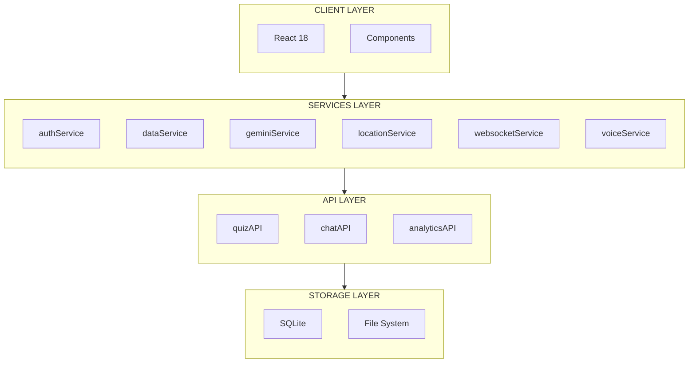

# Gyandeep Module Design

## Module-Services Relationship Diagram

```mermaid
flowchart TB
    subgraph Module1["MODULE 1: AUTHENTICATION"]
        direction TB
        C1A[Login]
        C1B[useAuth]
    end
    
    subgraph Service1["SERVICES"]
        S1[authService]
    end
    
    Module1 --> Service1
    
    subgraph Module2["MODULE 2: DASHBOARD"]
        direction TB
        C2A[StudentDashboard]
        C2B[TeacherDashboard]
        C2C[AdminDashboard]
        C2D[Dashboard3D]
    end
    
    subgraph Service2["SERVICES"]
        S2A[dataService]
        S2B[websocketService]
    end
    
    Module2 --> Service2
    
    subgraph Module3["MODULE 3: QUIZ"]
        direction TB
        C3A[QuizView]
        C3B[useQuizWorker]
    end
    
    subgraph Service3["SERVICES"]
        S3A[quizAPI]
        S3B[geminiService]
    end
    
    Module3 --> Service3
    
    subgraph Module4["MODULE 4: ATTENDANCE"]
        direction TB
        C4A[AttendanceChart]
        C4B[useClassSession]
        C4C[useTeacherSession]
    end
    
    subgraph Service4["SERVICES"]
        S4[locationService]
    end
    
    Module4 --> Service4
    
    subgraph Module5["MODULE 5: GRADE"]
        direction TB
        C5A[GradeBook]
        C5B[PerformanceChart]
        C5C[usePerformance]
    end
    
    subgraph Service5["SERVICES"]
        S5[dataService]
    end
    
    Module5 --> Service5
    
    subgraph Module6["MODULE 6: ANALYTICS"]
        direction TB
        C6A[RealtimeAnalytics]
        C6B[AnalyticsDashboard]
        C6C[EngagementMetrics]
    end
    
    subgraph Service6["SERVICES"]
        S6A[websocketService]
        S6B[dataService]
    end
    
    Module6 --> Service6
    
    subgraph Module7["MODULE 7: AI"]
        direction TB
        C7A[Chatbot]
    end
    
    subgraph Service7["SERVICES"]
        S7A[geminiService]
        S7B[voiceService]
    end
    
    Module7 --> Service7
    
    subgraph Module8["MODULE 8: FACE RECOGNITION"]
        direction TB
        C8A[StudentFaceRegistration]
        C8B[AdminFaceViewer]
        C8C[WebcamCapture]
    end
    
    subgraph Service8["SERVICES"]
        S8[useImageCompression]
    end
    
    Module8 --> Service8
    
    subgraph Module9["MODULE 9: UI COMPONENTS"]
        direction TB
        C9A[Button]
        C9B[Input]
        C9C[Card]
        C9D[Modal]
        C9E[Badge]
    end
    
    subgraph Service9["SERVICES"]
        S9[useThemeEngine]
    end
    
    Module9 --> Service9
    
    subgraph Module10["MODULE 10: LEARNING FEATURES"]
        direction TB
        C10A[StudentLearningTwin]
        C10B[DigitalClassroom]
        C10C[Timetable]
        C10D[AnnouncementBoard]
        C10E[Leaderboard]
    end
    
    subgraph Service10["SERVICES"]
        S10A[dataService]
        S10B[geminiService]
    end
    
    Module10 --> Service10
```

---

## Module Descriptions

### MODULE 1: AUTHENTICATION

**Description:**
The Authentication Module is responsible for managing user identity and access control. It handles user login, session management, and role-based access control (RBAC) for the entire application.

**Components:**
- **Login** - User login interface with email/password authentication
- **useAuth** - React hook for managing authentication state across the application

**Services:**
- **authService** - Handles JWT token generation, validation, and user authentication

**Features:**
- User registration and login
- JWT token management
- Session persistence
- Role-based access control (Student, Teacher, Admin)
- Logout functionality

---

### MODULE 2: DASHBOARD

**Description:**
The Dashboard Module provides role-specific dashboards for different user types. Each dashboard displays relevant information and quick access to features based on the user's role.

**Components:**
- **StudentDashboard** - Dashboard for students showing their grades, attendance, quizzes, and progress
- **TeacherDashboard** - Dashboard for teachers showing their classes, students, and teaching analytics
- **AdminDashboard** - Dashboard for administrators showing system overview and user management
- **Dashboard3D** - 3D visualization of classroom using React Three Fiber

**Services:**
- **dataService** - Fetch and manage dashboard data
- **websocketService** - Real-time updates for dashboard metrics

**Features:**
- Role-based dashboard rendering
- Quick stats and summaries
- Recent activity feed
- Quick action buttons
- 3D classroom visualization

---

### MODULE 3: QUIZ

**Description:**
The Quiz Module manages the entire quiz lifecycle including creation, distribution, taking, and scoring of quizzes. It supports AI-powered quiz generation using Google Gemini.

**Components:**
- **QuizView** - Interface for students to take quizzes
- **useQuizWorker** - Web worker for handling quiz logic without blocking the main thread

**Services:**
- **quizAPI** - API endpoints for quiz CRUD operations
- **geminiService** - AI-powered quiz generation

**Features:**
- Quiz generation (AI-powered)
- Multiple choice questions
- Timer-based quizzes
- Auto-scoring
- Quiz history and results
- Question bank management

---

### MODULE 4: ATTENDANCE

**Description:**
The Attendance Module handles location-based attendance marking. Teachers can start a session and students can mark their attendance based on their GPS location within a specified radius.

**Components:**
- **AttendanceChart** - Visual representation of attendance data
- **useClassSession** - Hook for managing active class sessions
- **useTeacherSession** - Hook for teachers to manage their sessions

**Services:**
- **locationService** - GPS location tracking and radius verification

**Features:**
- Location-based attendance marking
- Real-time attendance tracking
- Session-based attendance
- Attendance reports and analytics
- Teacher-controlled session start/end

---

### MODULE 5: GRADE

**Description:**
The Grade Module manages student grades and performance tracking. Teachers can enter grades while students can view their performance history.

**Components:**
- **GradeBook** - Interface for viewing and managing grades
- **PerformanceChart** - Visual charts showing student performance over time
- **usePerformance** - Hook for tracking and calculating performance metrics

**Services:**
- **dataService** - CRUD operations for grades

**Features:**
- Grade entry by teachers
- Grade viewing by students
- Performance analytics
- Subject-wise grade tracking
- Grade history

---

### MODULE 6: ANALYTICS

**Description:**
The Analytics Module provides real-time analytics and insights about student performance, engagement, and attendance. It uses WebSocket for live data updates.

**Components:**
- **RealtimeAnalytics** - Real-time analytics display with live updates
- **AnalyticsDashboard** - Comprehensive dashboard for viewing analytics
- **EngagementMetrics** - Metrics showing student engagement levels

**Services:**
- **websocketService** - Real-time data streaming
- **dataService** - Analytics data management

**Features:**
- Live performance tracking
- Attendance trends
- Engagement metrics
- Performance predictions
- Real-time updates via WebSocket

---

### MODULE 7: AI

**Description:**
The AI Module provides AI-powered features using Google Gemini for natural language processing and voice services for speech recognition.

**Components:**
- **Chatbot** - AI-powered chatbot for student assistance

**Services:**
- **geminiService** - Google Gemini AI integration for chat and insights
- **voiceService** - Speech-to-text and text-to-speech capabilities

**Features:**
- AI chatbot assistance
- Quiz generation via AI
- Learning insights
- Voice commands
- Natural language queries

---

### MODULE 8: FACE RECOGNITION

**Description:**
The Face Recognition Module handles face detection and recognition for authentication and student identification purposes.

**Components:**
- **StudentFaceRegistration** - Interface for students to register their face
- **AdminFaceViewer** - Interface for admins to view registered faces
- **WebcamCapture** - Component for capturing face images from webcam

**Services:**
- **useImageCompression** - Compress face images for storage

**Features:**
- Face enrollment
- Face-based login
- Attendance verification
- Student identification
- Image compression and optimization

---

### MODULE 9: UI COMPONENTS

**Description:**
The UI Components Module provides a library of reusable, styled UI components for consistent design across the application.

**Components:**
- **Button** - Reusable button component
- **Input** - Form input component
- **Card** - Card container component
- **Modal** - Modal dialog component
- **Badge** - Status badge component

**Services:**
- **useThemeEngine** - Theme management and styling

**Features:**
- Consistent styling with Tailwind CSS
- Reusable props interface
- Accessibility support
- Theme switching (light/dark)
- Responsive design

---

### MODULE 10: LEARNING FEATURES

**Description:**
The Learning Features Module provides additional educational tools including digital classroom visualization, timetables, announcements, and gamification elements.

**Components:**
- **StudentLearningTwin** - Digital twin representation of student learning progress
- **DigitalClassroom** - Virtual classroom environment
- **Timetable** - Class schedule management
- **AnnouncementBoard** - School-wide announcements
- **Leaderboard** - Gamification with rankings, XP, and badges

**Services:**
- **dataService** - Data operations for learning features
- **geminiService** - AI insights for learning paths

**Features:**
- Learning path visualization
- Digital twin representation
- Timetable management
- Announcements system
- Gamification (XP, badges, coins, levels)
- Student engagement features

---

## Module Summary Table

| # | Module | Components | Services |
|---|--------|-----------|----------|
| 1 | Authentication | Login, useAuth | authService |
| 2 | Dashboard | StudentDashboard, TeacherDashboard, AdminDashboard, Dashboard3D | dataService, websocketService |
| 3 | Quiz | QuizView, useQuizWorker | quizAPI, geminiService |
| 4 | Attendance | AttendanceChart, useClassSession, useTeacherSession | locationService |
| 5 | Grade | GradeBook, PerformanceChart, usePerformance | dataService |
| 6 | Analytics | RealtimeAnalytics, AnalyticsDashboard, EngagementMetrics | websocketService, dataService |
| 7 | AI | Chatbot | geminiService, voiceService |
| 8 | Face Recognition | StudentFaceRegistration, AdminFaceViewer, WebcamCapture | useImageCompression |
| 9 | UI Components | Button, Input, Card, Modal, Badge | useThemeEngine |
| 10 | Learning Features | StudentLearningTwin, DigitalClassroom, Timetable, AnnouncementBoard, Leaderboard | dataService, geminiService |

---

## System Architecture

